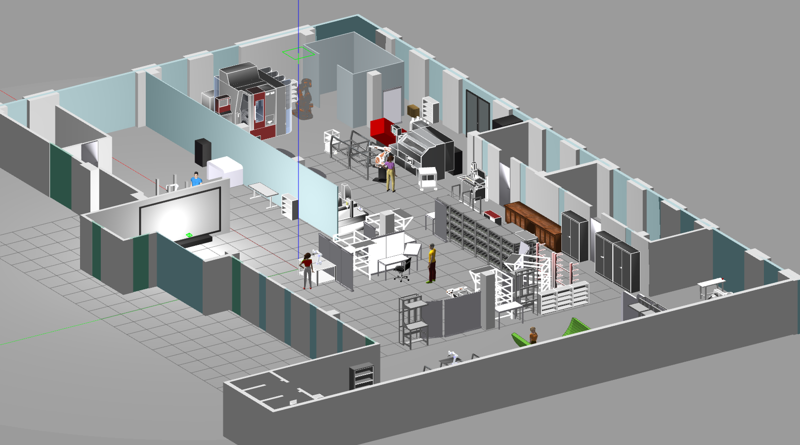

# Welcome to the Industrial Mobile Manipulation Challenge (IMMC)

Virtual Micro Challenge 2022 is a part of the Industrial Mobile Manipulation Challenge (IMMC) - an international initiative funded by EIT-Manufacturing, aiming to promote mobile manipulation technology and make progress in the field of human-machine co-working in manufacturing.

This repository contains software packages for Virtual Micro Challenge 2022 and it is supposed to be used by the participants and organizers.

For the details about Virtual Micro Challenge 2022 please refer to the [Rulebook](immc_virtual_micro_rulebook_2022.pdf)

## Repository Overview

### [immc_bringup](immc_bringup)

Contains the `launch/immc_bringup_factory.launch` which is the starting point of the task within the Virtual Micro Challenge.

### [immc_demo](immc_demo)

Demo pipeline of navigation and manipulation capabilities of the mobile manipulator.

### [immc_orders](immc_orders)

Contains the order manager node.

### [immc_msgs](immc_msgs)

Message and service definitions for Virtual Micro Challenge 2022.

### [pilotfactory_gazebo](pilotfactory_gazebo)

Gazebo world for the Virtual Micro Challenge 2022.

### [gazebo_ros_link_attacher](gazebo_ros_link_attacher)

ROS package for grasping simplification [by Sam Pfeiffer, PAL Robotics](https://github.com/pal-robotics/gazebo_ros_link_attacher)

### [mobile_manipulator](mobile_manipulator)

Turtlebot3 mobile platform with OpenManipulator robot arm [by ROBOTIS](https://emanual.robotis.com/docs/en/platform/turtlebot3/manipulation/)

## Installation

1. Make sure your environment has ROS Noetic and Gazebo 11 installed. [Installation guide](http://wiki.ros.org/noetic/Installation)
2. Navigate to you workspace/src
3. `$ git clone https://github.com/wddler/immc.git`
4. `$ cd immc`
5. `$ catkin_make`

### Troubleshooting

If you have the error:

    [FATAL] [1665410400.733178897, 103.299000000]: Failed to create the dwa_local_planner/DWAPlannerROS planner, are you sure it is properly registered and that the containing library is built? Exception: According to the loaded plugin descriptions the class dwa_local_planner/DWAPlannerROS with base class type nav_core::BaseLocalPlanner does not exist. Declared types are  base_local_planner/TrajectoryPlannerROS

Try to install the missing package:

`$ sudo apt-get install ros-noetic-dwa-local-planner`

## Citation

How to cite:

`Zatyagov, D., Killingseder, P., Ozan, K., Reiterer, B., Rahmani Choubeh, N., & Wallner, B. (2022). Industrial Mobile Manipulation Challenge 2022 [Computer software]. https://github.com/wddler/immc`
